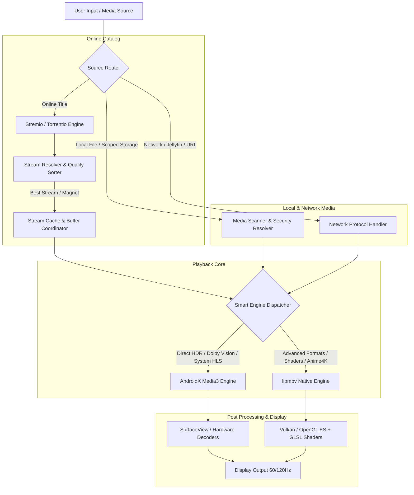

<p align="center">
  
</p>

<h1 align="center">NextPlayer</h1>

<p align="center">
  <b>The Ultimate High-Performance Android Media Player & Next-Gen Streaming Hub</b><br>
  <i>Powered by a Hybrid Architecture of <b>libmpv</b> and <b>AndroidX Media3 (ExoPlayer)</b></i>
</p>

<p align="center">
  <a href="https://github.com/mindcreative134-creator/nextplayer"></a>
  <a href="https://github.com/mindcreative134-creator/nextplayer"></a>
  <a href="https://github.com/mindcreative134-creator/nextplayer"></a>
  <a href="https://github.com/mindcreative134-creator/nextplayer"></a>
  <a href="https://github.com/mindcreative134-creator/nextplayer"></a>
</p>

---

## 🌟 Overview

**NextPlayer** is a state-of-the-art Android video player built for audiophiles, cinephiles, and power users. While conventional video players force you to choose between standard platform codecs or heavyweight software decoders, **NextPlayer** bridges both worlds with an intelligent **Hybrid Engine Pipeline**:

1. **libmpv (v0.39 Core)**: Unlocks extreme customization, real-time GLSL video shaders (Anime4K, AMD FSR, debanding), custom subtitle rendering, and native playback of exotic codecs.
2. **AndroidX Media3 (ExoPlayer)**: Provides platform-native hardware decoding, Dolby Vision, HDR10+, ultra-low battery consumption, and seamless system integrations (Picture-in-Picture, background media session, Google Cast).
3. **Out-of-the-Box Online Streaming**: Built-in direct streaming catalog powered by the **Torrentio** scraper engine — stream movies, TV shows, and anime in 4K/1080p directly with seeder-aware routing and zero setup required.

100% Clean. Zero Ads. Zero Trackers. Complete Privacy.

---

## 🏗️ System Architecture



---

## 📊 Comprehensive Player Comparison

How does **NextPlayer** compare against the most popular Android media players?

| Feature / Capability | 🚀 NextPlayer | VLC for Android | MX Player | mpv-android | Just Player | Nova Video Player |
|---|:---:|:---:|:---:|:---:|:---:|:---:|
| **Playback Engine** | **Dual (MPV + Media3)** | VLC LibVLC | Custom ExoPlayer | Single libmpv | Media3 Only | Custom ffmpeg/exo |
| **Built-in Online Streaming Catalog** | ✅ **Yes (Torrentio)** | ❌ No | ❌ Ads/Paywall | ❌ No | ❌ No | ❌ No |
| **Dolby Vision & HDR10+ Support** | ✅ **Native Hardware** | ⚠️ Partial | ⚠️ Codec dependent | ⚠️ Tonemapped | ✅ Native | ⚠️ Basic |
| **Anime4K & FSR Upscaling** | ✅ **Built-in Shaders** | ❌ No | ❌ No | ⚠️ Manual Script | ❌ No | ❌ No |
| **GPU Debanding & Dithering** | ✅ **Yes (GLSL)** | ❌ No | ❌ No | ✅ Yes | ❌ No | ❌ No |
| **Dual Layered Subtitles** | ✅ **Yes** | ❌ No | ❌ No | ⚠️ Complex setup | ❌ No | ❌ No |
| **Online Subtitle Downloader** | ✅ **Multi-provider** | ✅ OpenSubtitles | ⚠️ With Ads | ❌ No | ❌ No | ✅ OpenSubtitles |
| **Jellyfin Client Integration** | ✅ **Direct Native** | ❌ No | ❌ No | ❌ No | ❌ No | ❌ No |
| **Gesture Controls & Boost** | ✅ **Fluid + 8x Speed** | ✅ Basic | ⚠️ Basic | ⚠️ Basic | ⚠️ Minimal | ⚠️ Basic |
| **UI Design System** | ✅ **Material 3 Expressive** | ⚠️ Legacy UI | ⚠️ Ad Cluttered | ⚠️ Outdated | ⚠️ Simple | ⚠️ Android TV Focus |
| **100% Ad-Free & Private** | ✅ **Completely Free** | ✅ Yes | ❌ Heavily Monetized | ✅ Yes | ✅ Yes | ✅ Yes |

---

## 🚀 A-to-Z Detailed Feature Tour

### 🎬 1. Dual Playback Engine (libmpv + Media3)
- **Automatic Engine Routing**: NextPlayer inspects container metadata and routes complex Dolby Vision profile 5/7/8 or low-latency streams to Media3, while directing anime, multi-track MKVs, and high-bitrate media to libmpv.
- **On-the-Fly Switching**: Easily swap the playback engine mid-video from the in-player Decoder Sheet without losing your playback position.
- **Hardware Acceleration**: Full support for `mediacodec`, `mediacodec-copy`, and raw Vulkan rendering pipelines.

### 🌐 2. Native Online Streaming & Catalog (Torrentio)
- **Zero Configuration Required**: Equipped with a high-performance default resolver (`https://torrentio.strem.fun`).
- **Smart Stream Aggregation**: Automatically extracts and categorizes streams by quality:
  - **4K / UHD**
  - **1080p / FHD**
  - **720p / HD**
  - **SD**
- **Seeder Health & Speed Sort**: Streams are ranked by real-time seeder count and source reliability to eliminate buffering.
- **Binge-Watching Series Support**: Automatic episode and season indexing with consecutive playback.

### 🎨 3. Visual Pipeline, Shaders & Post-Processing
- **Anime4K Upscaling Pipeline**: Real-time ultra-fast neural upscaling algorithm tailored for high-quality anime playback on mobile GPUs.
- **AMD FidelityFX Super Resolution (FSR)**: Spatial upscaler that enhances edge sharpness and texture clarity in live-action cinema.
- **Advanced HDR Tonemapping**: 77+ bundled GLSL shaders powered by `hdr-toys` for BT.2100 PQ, HLG, and BT.2020 color spaces.
- **GPU Debanding**: Eliminates ugly color banding and compression artifacts in dark scenes with customizable threshold and range.

### 🔊 4. Audio Engine & Multi-Channel Surround
- **Jellyfin FFmpeg Audio Extension**: Plays TrueHD, DTS-HD MA, EAC3-JOC, FLAC, and Opus without silence or compatibility errors.
- **Volume Boost up to 200%**: Clean software pre-amplification for quiet movies and dialogue.
- **Night Mode / Dynamic Range Compression (DRC)**: Boosts whisper-quiet dialogues while softening loud explosions.
- **Audio Pitch Correction**: Maintains natural pitch even when playing at 0.25x or 4.0x speeds.

### 💬 5. Subtitle Hub & Dual Subtitle Engine
- **Dual Simultaneous Subtitles**: Display two subtitle tracks at once (e.g., Target Language on bottom, Native Language on top) — ideal for language learners.
- **Online Subtitle Search**: Fetch synced subtitles automatically using video hash matching.
- **Custom SSA/ASS Styling**: Full control over font family, font size, stroke outline, shadow, vertical alignment, and timing sync offset (±10ms precision).
- **Interactive Subtitle Gestures**: Drag subtitles anywhere on screen; pinch to resize them in real-time.

### 🖐️ 6. Fluid Gestures & Navigation
- **Multi-Zone Tap Seeking**: Precision double-tap left, center, or right with configurable seek intervals (5s, 10s, 15s, 30s).
- **Long-Press Dynamic Speed**: Press and hold anywhere to boost speed up to 2x/3x; swipe left or right while holding to fine-tune speed on the fly.
- **Pinch-to-Zoom & Free Pan**: Zoom up to 300% into any part of the frame to inspect fine cinematic details.
- **Independent Brightness & Volume Sliders**: Smooth vertical swipes with separate volume boost zone and side swapping options.

### 📱 7. Media Library & File Explorer
- **Folder & Video Views**: Clean presentation with thumbnail previews, playback progress bars, and duration tags.
- **Scoped Storage Full Access**: Flawless playback of local files, SD cards, USB OTG drives, and SAF `content://` URIs.
- **Recently Played**: Instant one-tap resume from where you left off.
- **Playlist & Queue Management**: Shuffle, loop single video, loop playlist, and auto-play next file in directory.

### 📡 8. Network Streaming & Casting
- **Google Cast & DLNA**: Cast local and remote videos directly to your Smart TV or Chromecast device.
- **Network Protocols**: Direct playback from HTTP/HTTPS, HLS (`.m3u8`), DASH (`.mpd`), RTSP, RTMP, and WebDAV.
- **Jellyfin Client**: Connect directly to your personal media server, sync watch progress, and stream remotely.

---

## 📱 Application Screens

| Screen | Description |
|---|---|
| **📁 Media Browser** | Beautiful directory grid with folder sorting, search, hidden file toggles, and metadata previews. |
| **🌐 Online Catalog** | Trending movies, popular TV shows, search bar, and genre filters powered by the integrated scraper. |
| **🎯 Stream Picker** | Comprehensive stream selector showing resolution, codec, file size, seeder count, and provider. |
| **🎬 Cinema Player** | Immersive player surface with transparent glassmorphism controls, quick action bars, and gesture HUD. |
| **⚙️ Decoder & Audio Sheet** | Instant access to audio track selection, subtitle downloader, engine toggle (MPV ↔ Media3), and shaders. |
| **🎨 Customization Settings** | 25+ Material 3 color themes, AMOLED pure black mode, gesture sensitivity, and subtitle customization. |

---

## 🛠️ Building & Installation

### Prerequisites
- **Android Studio** Ladybug (2024.2+) or later
- **JDK**: Java 21 LTS
- **Android SDK**: API Level 36 (Minimum SDK: 26 / Android 8.0)
- **NDK**: 27.2+ for native C/C++ libmpv bindings

### Build Instructions

1. **Clone the Repository**:
   ```bash
   git clone https://github.com/mindcreative134-creator/nextplayer.git
   cd nextplayer
   ```

2. **Assemble Release APK**:
   ```bash
   ./gradlew assemblePlaystoreRelease
   ```
   *Output APK location:* `app/build/outputs/apk/playstore/release/app-playstore-release.apk`

3. **Build Google Play App Bundle (AAB)**:
   ```bash
   ./gradlew bundlePlaystoreRelease
   ```
   *Output AAB location:* `app/build/outputs/bundle/playstoreRelease/app-playstore-release.aab`

---

## 📄 License & Attribution

NextPlayer is licensed under the **GNU Affero General Public License v3.0 (AGPL-3.0)**.

### Credits & Upstream Lineage
NextPlayer is proudly built upon the pioneering work of open-source projects:
- **[libmpv](https://mpv.io/)** — The foundational media playback engine.
- **[AndroidX Media3](https://github.com/androidx/media)** — Android's modern playback framework.
- **[mpv-android](https://github.com/mpv-android/mpv-android)** & **[mpvRx](https://github.com/Riteshp2001/mpvRx)** — Architecture lineage and Android MPV JNI integration.
- **[Jellyfin](https://jellyfin.org/)** — Media3 FFmpeg audio decoders and client API.
- **[Anime4K](https://github.com/bloc97/Anime4K)** — High-quality anime upscaling shaders.
- **[hdr-toys](https://github.com/natural-harmonia-gropius/hdr-toys)** — GLSL HDR color pipeline shaders.

---

<p align="center">
  Crafted with ❤️ by <a href="https://github.com/mindcreative134-creator"><b>mindcreative134-creator</b></a>
</p>
