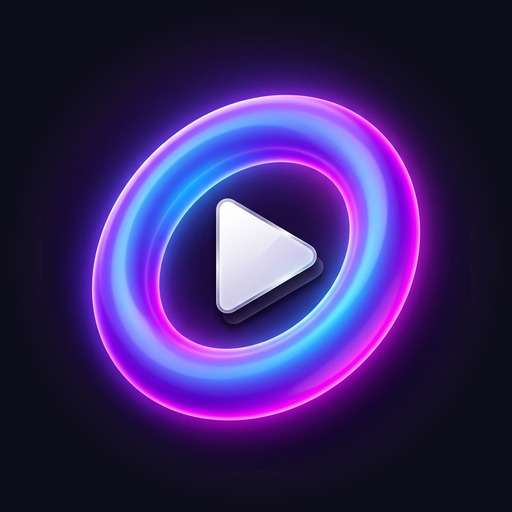
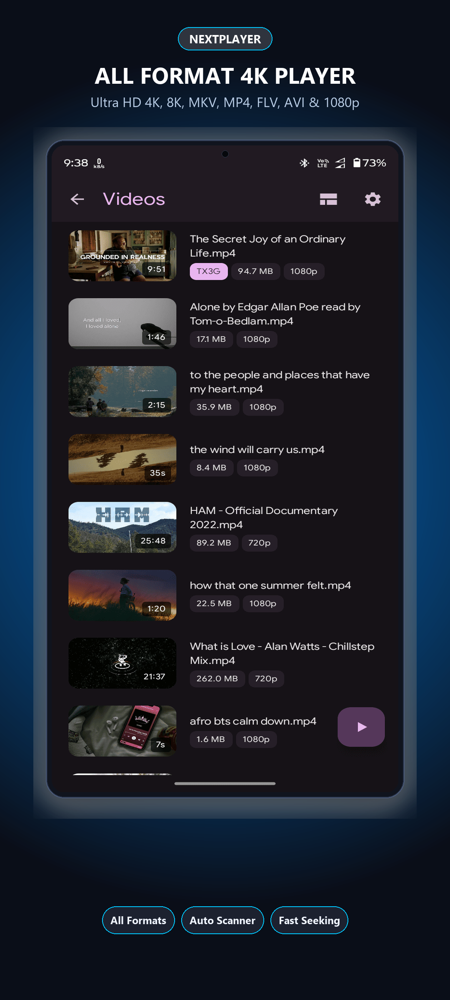
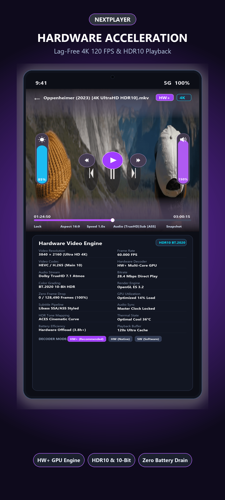
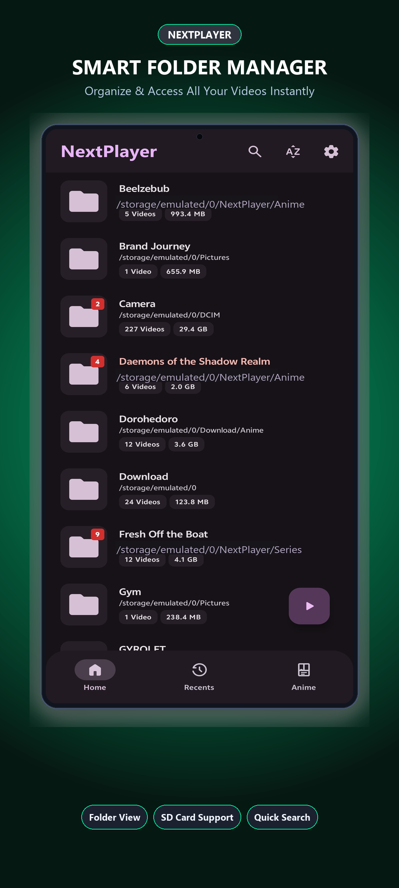
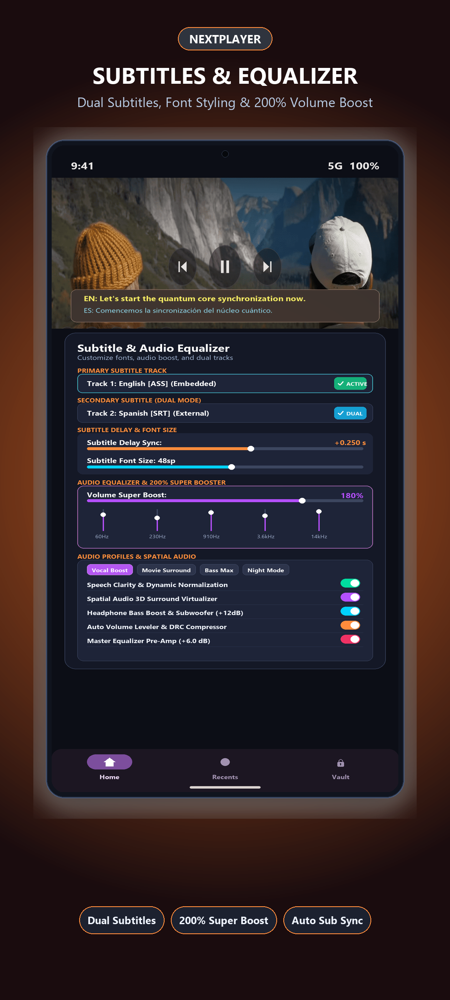
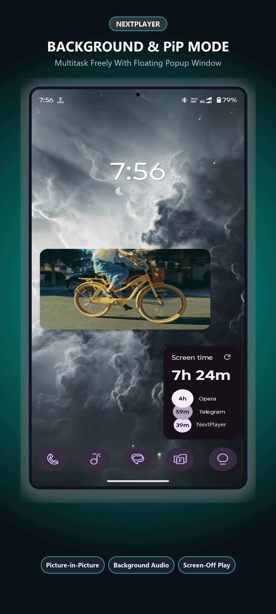
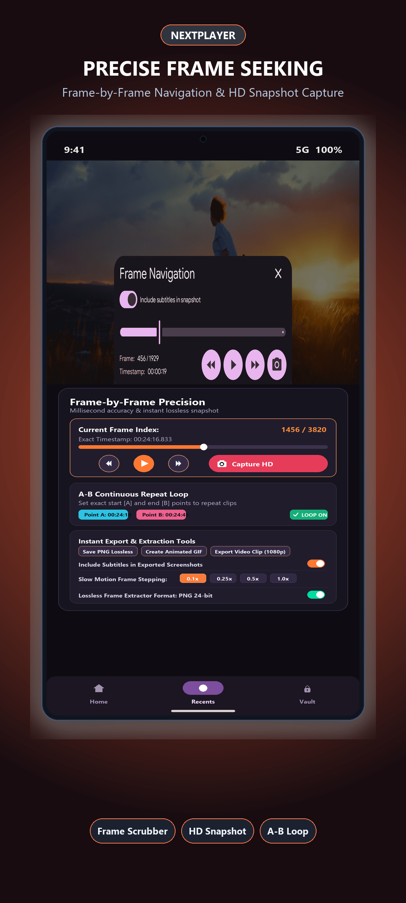

<p align="center">
  
</p>

<h1 align="center">Next Player</h1>

<p align="center">
  <b>The Next-Generation, High-Performance Android Media Powerhouse</b>
  <br>
  <i>Powered by Dual Playback Engines (MPV + AndroidX Media3), Material 3 Expressive Design, and Studio-Grade Video/Audio Processing.</i>
</p>

<p align="center">
  <a href="https://github.com/mindcreative134-creator/nextplayer/releases"></a>
  <a href="https://github.com/mindcreative134-creator/nextplayer"></a>
  <a href="https://github.com/mindcreative134-creator/nextplayer"></a>
  <a href="https://github.com/mindcreative134-creator/nextplayer"></a>
  <a href="https://github.com/mindcreative134-creator/nextplayer/blob/main/LICENSE"></a>
</p>

---

## 🌟 Overview

**Next Player** is a feature-packed, modern Android media player designed for audiophiles, cinephiles, anime enthusiasts, and power users. Built from the ground up to combine the raw decoding versatility of **libmpv** with the modern hardware-accelerated pipeline of **AndroidX Media3 (ExoPlayer)**, Next Player delivers unrivaled playback performance, zero-buffering seeking, high-fidelity audio, and a breathtaking **Material 3 Expressive** interface with frosted glass aesthetics.

Whether you are streaming 4K HDR10+ / Dolby Vision cinema over SMB/WebDAV, watching anime enhanced with Anime4K GLSL upscaling shaders, enjoying lossless FLAC music, or flicking through short videos in a dedicated Reels feed, **Next Player** provides a smooth, elegant, and unified experience.

---

## 📸 Screenshots & Showcase

<div align="center">
  
  
  
</div>

<br>

<div align="center">
  
  
  
</div>

<br>

<div align="center">
  
</div>

---

## 🚀 Key Features

### ⚙️ Dual Playback Engines: MPV + AndroidX Media3
- **libmpv Engine**: Full desktop-grade `libmpv` port for Android. Supports virtually every video container and audio/video codec ever conceived, advanced GPU renderers (`gpu`, `gpu-next`), custom GLSL shaders, and Lua/JavaScript scripting.
- **AndroidX Media3 (ExoPlayer) Engine**: Native hardware-accelerated playback with full platform codec integration, system surface optimization, and low power consumption.
- **Intelligent Engine Routing**: Automatically activates Media3 for complex Dolby Vision (Profile 5, Profile 8) and adaptive DASH/HLS streams, while routing complex anime MKVs with ASS subtitles to MPV.
- **Instant Decoder Switching**: Seamlessly toggle between MPV and Media3 on-the-fly directly from the playback decoder sheet without losing playback position.

---

### 🎨 Material 3 Expressive UI & Customization
- **Modern Frosted Glass Controls**: Translucent, floating pill control bars with dynamic blurs and responsive tactile feedback.
- **25+ Curated Color Themes**: Dynamic Material You (monet palette), Catppuccin, Nord, Tokyo Night, Rosé Pine, Gruvbox, Dracula, Cyberpunk, and more.
- **AMOLED Pure Black Mode**: Deep true-black backgrounds across the entire app for OLED battery savings and high contrast.
- **5 Player Control Animations**: Choose between Default, Elastic Bounce, Cinematic Scale, Slide Up, and Minimal Fade transitions.
- **Customizable Control Layouts**: Fully configurable zones (top-left, top-right, bottom-left, bottom-right) with 25+ assignable quick-action buttons.

---

### 📺 4K/8K HDR, Shaders & Video Pipeline
- **HDR Standards**: Full support for Dolby Vision (Profile 5, Profile 7 MEL/FEL fallback, Profile 8), HDR10+, BT.2100 PQ, BT.2100 HLG, and Linear HDR.
- **Anime4K Real-Time Upscaling**: Bundled high-performance GLSL shaders (Tiers A, B, C, A+, B+, C+) for anime enhancement with proactive thermal throttling.
- **GPU Debanding & Dithering**: Eliminate banding artifacts in dark and gradient scenes with configurable threshold and grain settings.
- **Dynamic Refresh Rate**: Matches display refresh rates (24Hz, 48Hz, 60Hz, 120Hz) to video frame rate for tear-free cinematic cadence.
- **Ambient Glow Mode**: Ambient lighting shaders (`GLOW` and `FRAME_EXTEND`) extend video color ambiance beyond the letterbox borders.

---

### 🎵 High-Fidelity Audio & Surround Sound
- **Multi-Channel Passthrough**: True 7.1 and 5.1 surround sound support for Dolby Atmos, Dolby Digital Plus (E-AC-3), TrueHD, DTS-HD, and DTS:X.
- **Bundled FFmpeg Audio Extension**: Enables lossless and niche format decoding (FLAC, ALAC, Opus, APE, WavPack, DSD).
- **200% Volume Boost**: Push audio beyond standard hardware levels with distortion-limiting volume boost.
- **OpenGL ES Audio Visualizer**: 3D interactive FFT-reactive fluid audio blob with bloom, pinch zoom, and touch rotation.

---

### 📱 All-in-One Media Hub
- **Video Browser**: Dual browsing views (Folder Album Grid & File Manager Tree), recursive file/duration counts, pinned folders, auto-scroll to last played.
- **Shorts / Reels Feed**: Vertical video player with smooth snap-scrolling, quick swipe navigation, auto-looping, and thumbnail previews.
- **Complete Music Library**: Dedicated audio library with Albums, Artists, Songs, embedded cover art rendering, and persistent playback queue.
- **Private Vault**: Password-protected vault to keep private media isolated and hidden from system scanners.

---

### 📝 Comprehensive Subtitle Mastery
- **Dual Subtitle Rendering**: Render two subtitle tracks simultaneously (e.g., native language dialogue + foreign sign translation).
- **Styling Customization**: Custom font family loader (`.ttf`/`.otf`), font cache manager, scalable sizing, border stroke, and shadow offset.
- **Online Subtitle Downloader**: Integrated search via SubtitleHub (aggregating 6 providers), Wyzie, and TMDB episode matching.
- **AI Subtitle Translation & Formatting**: Integrated LLM subtitle translation and style enhancement (OpenAI, Anthropic, Groq, OpenRouter).
- **Speech-to-Text Transcription**: Generate live subtitles using cloud transcription or experimental on-device Whisper models.

---

### 🌐 Network Streaming & Ecosystem
- **Network Storage**: Built-in SMB (Windows Shares/Samba), FTP/FTPS, and WebDAV streaming clients.
- **Native Jellyfin Client**: Browse libraries, view rich metadata and posters, manage watch status, and play Jellyfin media natively.
- **Seerr / Overseerr Integration**: Search media and send requests directly from the app with real-time server availability status.
- **yt-dlp Native Bridge**: Stream online video from YouTube, Twitch, Bilibili, and hundreds of supported services with selectable video/audio streams (SDK 29+ native Python bridge).
- **Google Cast**: Cast local and remote streams directly to Chromecast and Android TV devices with seamless position handoff.
- **Syncplay**: Join Syncplay rooms to watch videos together in real-time sync with friends.
- **IPTV / M3U Playlists**: Full parsing and playback for local and remote `.m3u` / `.m3u8` playlists.

---

### 🖐️ Precision Gesture Controls
- **Double-Tap Zone Seeking**: Configurable left, center, and right zones with customizable seek step intervals.
- **Swipe Brightness & Volume**: Vertical swipe on left/right screen edges with percentage indicators (swappable).
- **Horizontal Swipe Seek**: Fine-grained seeking across the video with live elapsed/delta time overlay.
- **Pinch-to-Zoom & Pan**: Smooth zoom from 0.5x up to 3x with single-finger viewport panning.
- **Long-Press Speed Boost**: Instant 2x / 3x speed boost with dynamic slider adjustment across 8 speed presets.
- **Subtitle Gesture**: Long-press and drag subtitles anywhere on screen; pinch to resize subtitles dynamically.

---

## 🛠️ Tech Stack & Architecture

| Layer | Technology |
|---|---|
| **Language** | Kotlin (100% Coroutines & Flow), C/C++ (NDK) |
| **UI Framework** | Jetpack Compose, Material 3 Expressive Design |
| **Engines** | libmpv (C API / JNI), AndroidX Media3 (ExoPlayer) |
| **Audio Pipeline** | AndroidX Media3 Audio, Jellyfin FFmpeg Audio Decoder |
| **Local Database** | Room Database (SQLite with Flow integration) |
| **Scripting & Shaders**| QuickJS-NG, Lua 5.2, GLSL Shader Pipeline (Anime4K, hdr-toys) |
| **Dependency Injection**| Koin |
| **Networking** | OkHttp 4, Retrofit, smbj, jsch, Sardine WebDAV |

---

## 🔨 Building from Source

### Prerequisites
- **JDK**: Java 17 or Java 21 (recommended)
- **Android SDK**: Build Tools `35.0.0`+, SDK Platform `35`
- **NDK**: Version `27.0.12077973` or compatible
- **Git**

### Build Commands

Clone the repository:
```bash
git clone https://github.com/mindcreative134-creator/nextplayer.git
cd nextplayer
```

Compile debug APK:
```powershell
# Standard Debug APK
./gradlew.bat :app:assembleStandardDebug

# Play Store Debug APK
./gradlew.bat :app:assemblePlaystoreDebug
```

Compile release APK:
```powershell
./gradlew.bat :app:assembleStandardRelease
```

### Supported ABI Architectures
- `arm64-v8a` (Recommended for modern smartphones and tablets)
- `armeabi-v7a` (Legacy 32-bit devices)
- `x86_64` (64-bit Android emulators and Chromebooks)
- `x86` (32-bit x86 devices)
- `universal` (Combined APK containing all architectures)

---

## 🤝 Community & Support

- **Bug Reports & Feature Requests**: Open an issue on our [GitHub Issues Tracker](https://github.com/mindcreative134-creator/nextplayer/issues).
- **Releases**: Download prebuilt APKs from [GitHub Releases](https://github.com/mindcreative134-creator/nextplayer/releases).

---

## 📜 License & Acknowledgments

Next Player is distributed under the **GNU Affero General Public License v3.0 or later (AGPL-3.0-or-later)**. See [`LICENSE`](LICENSE) for complete terms.

Next Player proudly acknowledges and builds upon open-source giants in the multimedia community:
- [mpv](https://mpv.io/) & [mpv-android](https://github.com/mpv-android/mpv-android)
- [AndroidX Media3](https://developer.android.com/jetpack/androidx/releases/media3)
- [Jellyfin Media3 FFmpeg Decoder](https://github.com/jellyfin/jellyfin-androidx-media)
- [mpvRx](https://github.com/Riteshp2001/mpvRx) & [mpvEx](https://github.com/marlboro-advance/mpvEx)
- [Anime4K](https://github.com/bloc97/Anime4K) by bloc97
- [hdr-toys](https://github.com/natural-harmonia-gropius/hdr-toys)
- [QuickJS-NG](https://github.com/quickjs-ng/quickjs)
- [yt-dlp](https://github.com/yt-dlp/yt-dlp)

---

<p align="center">
  <b>Crafted with ❤️ for the ultimate media playback experience.</b>
</p>
